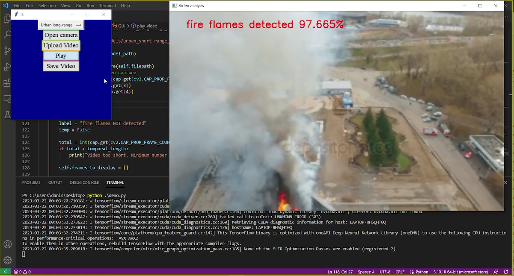
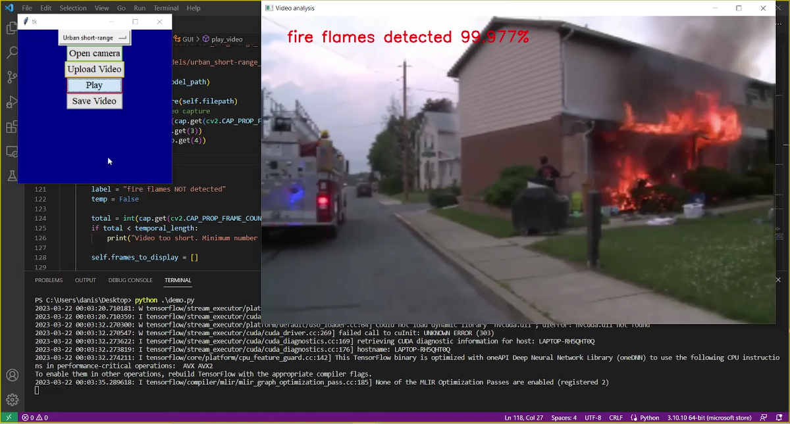
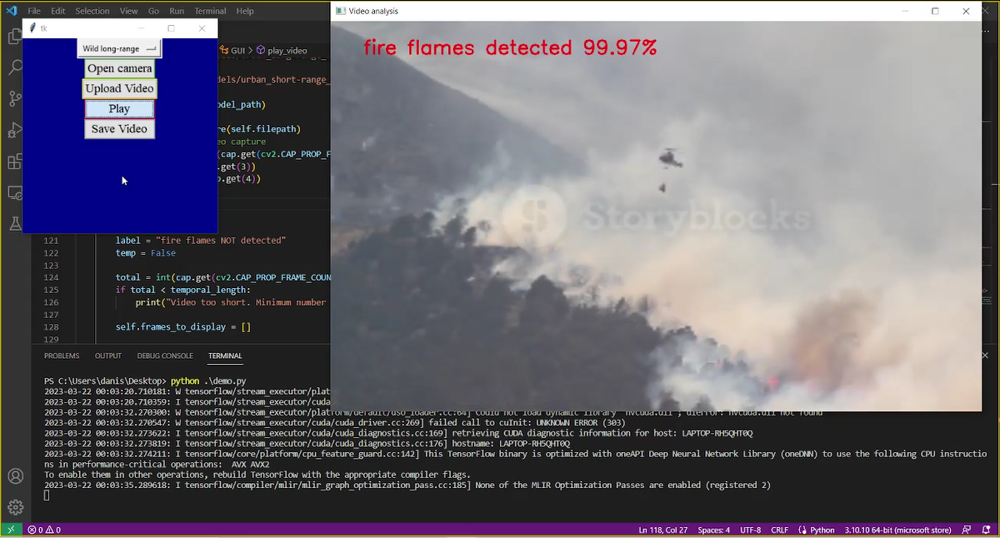
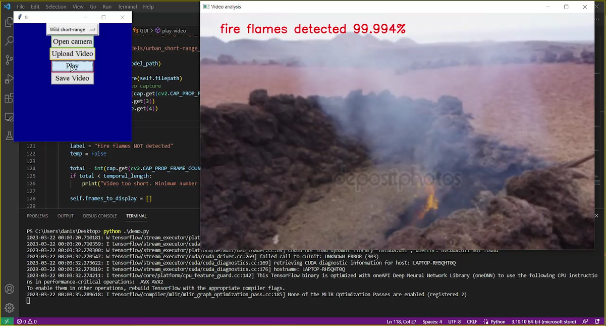
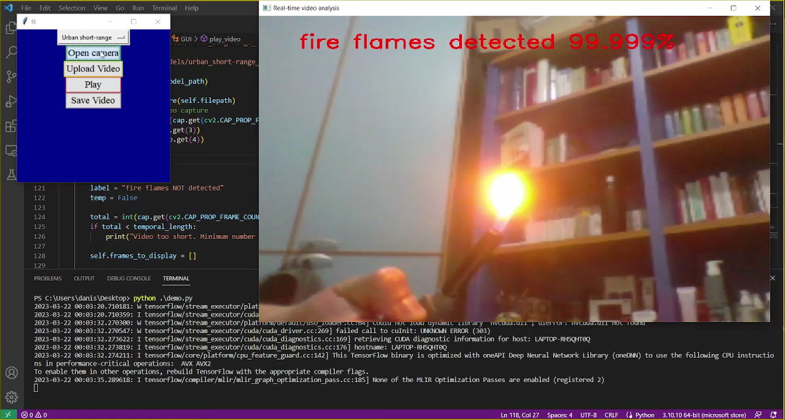

# 📽🔥 Video analysis algorithms for real-time fire flames detection using CNNs and LSTM

## 🤔 Why?
Fire detection is a critical component of modern safety systems, and early detection can save lives and prevent significant property damage. This research focuses on developing advanced video analysis algorithms that use Convolutional Neural Networks (CNNs) and Long Short-Term Memory networks (LSTMs) to detect fire flames in real time. By combining the power of deep learning with video surveillance, the system can identify fire outbreaks instantly, enabling quicker responses and reducing the risk of catastrophic outcomes. This work is crucial not only for enhancing public safety but also for advancing the field of AI-powered image and video processing, with applications spanning from fire prevention systems to disaster management.

## 🌟 Key Features
**1. Real-time detection**
- The system is designed to analyze video streams in real-time, enabling immediate identification of fire flames. This is critical for fast emergency responses, especially in environments where rapid action is required (e.g., buildings, factories, forests).

**2. Integration of CNNs and LSTM**
- CNNs (Convolutional Neural Networks): used for spatial feature extraction to detect visual patterns of fire flames, such as flickering, color variations, and movement.
- LSTM (Long Short-Term Memory network): incorporates temporal analysis, allowing the system to track the continuity of the fire across frames and recognize its evolution over time, which is essential for distinguishing fire from other visual disturbances.

**3. Enhanced Accuracy**
- The combination of CNNs and LSTMs results in improved detection accuracy, minimizing false positives (misidentifying non-fire objects as flames) and false negatives (missing actual flames).

**4. Robustness to environmental variability**
- The algorithm can handle different environmental conditions such as smoke, lighting changes, and varying background scenes. This adaptability makes it suitable for a variety of applications, including indoor and outdoor fire detection, from long range to short range, from urban to wild scenario.

**5. Scalability and deployment**
- The system can be deployed across a wide range of scenarios, from small-scale surveillance systems to large-scale monitoring networks in critical infrastructure. The algorithm is also scalable for integration into IoT-based smart safety systems.

**6. Data-Driven approach**
- The use of deep learning enables the model to learn from vast amounts of video data, improving its ability to recognize fire flames even in complex or less-conventional scenarios (e.g. cluttered and chaotic environments) without explicit rule-based programming.

**7. Low Latency for critical response**
- By processing video feeds with minimal delay, the system ensures that fire incidents are detected early enough for quick alerts, potentially preventing large-scale damage or injury. Furthermore, the neural network has been trained on multiple consecutive video frames at a time and its analysis is carried out in the same way, storing information from the recent past that influences decisions about the present (LSTM operation).

**8. Potential for Real-World Applications**
- This work has practical applications in various fields, including:

   - ***Building and Industrial Fire Safety Systems***
   - ***Smart Cities and Disaster Management***
   - ***Forest Fire Detection Systems***
   - ***Autonomous Drones for Fire Surveillance***

**9. Potential for Future Improvements**
- The system can be further enhanced by incorporating additional deep learning models for multi-modal sensor fusion (e.g., integrating temperature or smoke sensors with video data) or improving performance with more advanced networks.

## ⚡ Getting Started
1. Clone the repository:
   ```bash
   git clone https://github.com/danielesilvitelli/Video-analysis-algorithms-for-real-time-fire-flames-detection-using-CNNs-and-LSTM.git
   ```
2. Install dependencies:
   
   - Install OpenCV
      ```bash
      pip install opencv-python
      ```
   - Install numpy
      ```bash
      pip install numpy
      ```
   - Install TensorFlow
      ```bash
      pip install tensorflow
      ```
3. Run the project:
   ```bash
   python demo.py
   ```
4. Select the scenario based on the setting in which you want to detect the fire
5. Upload the video to analyze or open the PC camera if you want to detect fire where you are
6. Play the detection!
   
## 📸 Screenshots from demo
<figure>
  
  <figcaption>Figure 1 - Frame extracted from a video capture of an urban long-range scenario.</figcaption>
</figure>


         Figure 2 - ***Frame extracted from a video capture of an urban short-range scenario***


         Figure 3 - ***Frame extracted from a video capture of a wild long-range scenario***


         Figure 4 - ***Frame extracted from a video capture of a wild short-range scenario***


         Figure 5 - ***Webcam acquisition frame***

## 🤝 Contributing
I would greatly appreciate it if you would contribute to the improvement of the project! In this case, please follow these simple steps:
1. Fork the repository
2. Create a branch for your improvement (`git checkout -b feature/your-feature-name`)
3. Commit your changes (`git commit -m "Add new feature"`)
4. Push and open a Pull Request!

## 📚 Additional Resources
- [Official Documentation](https://github.com/danielesilvitelli/Video-analysis-algorithms-for-real-time-fire-flames-detection-using-CNNs-and-LSTM/blob/main/documentation.pdf)

## 🔔 Stay Updated!
- Follow the project on [LinkedIn](https://it.linkedin.com/in/daniele-silvitelli-a35326208) for the latest updates.
- Don't forget to **star** the repository if you liked it!
